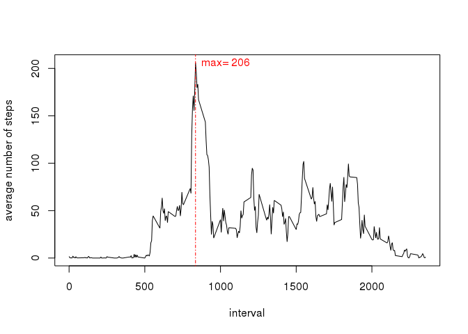
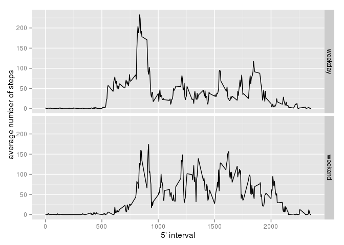

# Reproducible Research: Peer Assessment 1


## Loading and preprocessing the data
#### Show any code that is needed to:

* #### Load the data (i.e. read.csv())
* #### Process/transform the data (if necessary) into a format suitable for your analysis
 

```r
dat <- read.table("activity.csv", header=TRUE, sep=",", na.string="NA", stringsAsFactor=FALSE)
summary(dat)
```

```
##      steps           date              interval   
##  Min.   :  0.0   Length:17568       Min.   :   0  
##  1st Qu.:  0.0   Class :character   1st Qu.: 589  
##  Median :  0.0   Mode  :character   Median :1178  
##  Mean   : 37.4                      Mean   :1178  
##  3rd Qu.: 12.0                      3rd Qu.:1766  
##  Max.   :806.0                      Max.   :2355  
##  NA's   :2304
```

## What is mean total number of steps taken per day?
For this part of the assignment, you can ignore the missing values in the dataset.

* #### Make a histogram of the total number of steps taken each day

```r
steps_by_date <- aggregate(steps ~ date, data=dat, sum)
hist(steps_by_date$steps, main="Total Number of Steps Taken Each Day", xlab="Steps")
```

 
* #### Calculate and report the mean and median total number of steps taken per day


```r
dat_mean <- mean(steps_by_date$steps)
print(dat_mean)
```

```
## [1] 10766
```

```r
dat_median <- median(steps_by_date$steps)
print(dat_median)
```

```
## [1] 10765
```


## What is the average daily activity pattern?
* #### Make a time series plot (i.e. type = "l") of the 5-minute interval (x-axis) and the average number of steps taken, averaged across all days (y-axis)


```r
mean_steps_by_interval <- aggregate(steps ~ interval, data=dat, mean, na.rm=TRUE)
plot(mean_steps_by_interval, type="l", ylab="average number of steps")
idx <-which.max(mean_steps_by_interval$steps)
maxint <-mean_steps_by_interval[idx, "interval"]
maxsteps <- mean_steps_by_interval[idx, "steps"]
abline(v=maxint, lty=4, col="red") 
text(maxint + 200, maxsteps, labels=paste("max=", as.integer(maxsteps)), col="red")
```

 

* #### Which 5-minute interval, on average across all the days in the dataset, contains the maximum number of steps?


```r
max_interval <- mean_steps_by_interval[idx,]           
print(max_interval)
```

```
##     interval steps
## 104      835 206.2
```

```r
print(max_interval$interval)
```

```
## [1] 835
```

## Imputing missing values
Note that there are a number of days/intervals where there are missing values (coded as NA). The presence of missing days may introduce bias into some calculations or summaries of the data.

* #### Calculate and report the total number of missing values in the dataset (i.e. the total number of rows with NAs)

```r
sum(is.na(dat))
```

```
## [1] 2304
```
* #### Devise a strategy for filling in all of the missing values in the dataset. The strategy does not need to be sophisticated. For example, you could use the mean/median for that day, or the mean for that 5-minute interval, etc.

```r
fillstrategy <- function(stepsByInterval, data){
  results <- data
  nasidx <- which(is.na(dat))
  results[nasidx,]$steps <-as.integer(stepsByInterval[stepsByInterval$interval==results[nasidx,]$interval, ]$steps)
  return(results)
}
```

* #### Create a new dataset that is equal to the original dataset but with the missing data filled in.

```r
newdat <- fillstrategy(mean_steps_by_interval, dat)
```

* #### Make a histogram of the total number of steps taken each day. 

```r
newdat_steps_by_date <- aggregate(steps ~ date, data=newdat, sum)
hist(newdat_steps_by_date$steps, main="Total Number of Steps Taken Each Day", xlab="Steps")
```

 

* #### Calculate and report the mean and median total number of steps taken per day.

```r
newdat_mean <-mean(newdat_steps_by_date$steps)
print(newdat_mean)
```

```
## [1] 10764
```

```r
newdat_median <-median(newdat_steps_by_date$steps)
print(newdat_median)
```

```
## [1] 10703
```


* #### Do these values differ from the estimates from the first part of the assignment? 

```r
newdat_mean - dat_mean
```

```
## [1] -2.318
```

```r
newdat_median - dat_median
```

```
## [1] -62
```

Yes. By a slight amount.

* #### What is the impact of imputing missing data on the estimates of the total daily number of steps?

There is a slight impact on the mean and median after imputing the numbers via mean steps by interval.  Given the data, there does not seem a particular need to impute the numbers.  Simply ignoring the NA values provides enough similarity to explore the data and calculate rough estimates.

## Are there differences in activity patterns between weekdays and weekends?

For this part the weekdays() function may be of some help here. Use the dataset with the filled-in missing values for this part.

* #### Create a new factor variable in the dataset with two levels -- "weekday" and "weekend" indicating whether a given date is a weekday or weekend day.


```r
weekend <- c("Saturday", "Sunday")
newdat$day <- ifelse(weekdays(as.Date(newdat$date)) %in% weekend, "weekend", "weekday")
```

* #### Make a panel plot containing a time series plot (i.e. type = "l") of the 5-minute interval (x-axis) and the average number of steps taken, averaged across all weekday days or weekend days (y-axis). The plot should look something like the following, which was created using simulated data:

```r
library(ggplot2)
newdat_steps_by_day <- aggregate(steps ~ interval + day, data=newdat, mean)
ggplot(newdat_steps_by_day, aes(interval, steps)) + geom_line() + facet_grid(day ~ .) + xlab("5' interval") + ylab("average number of steps")
```

 
